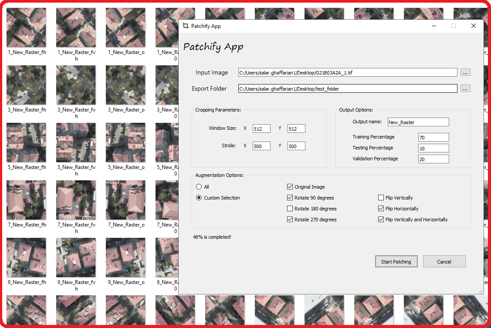

# Repository Name >> Train-Test-Validation-Dataset-Generation

## App Name >> Patchify

#### Description >> This app is designed for croping images and creating small patches of a large image e.g. Satellite/Aerial Images, which will then be used for training and testing Deep Learning models specifically **semantic segmentation** models.

Functionalities: Patchify is capable of:

 - Crop the large image into small patches based on the user-defined patch window-size and patch stride/step independently in two x and y directions.
 - Augmenting the cropped dataset to expand the size of the training dataset and make the model to improve the model performance with better generalizing for unseen samples.
 - Dividing the created dataset into different Train, Test, and Validation dataset with user defined percentages.

A picture of Patchify App is shown below:

### Parameters: 

- **Input Image**: is the input large image need to be cropped into small patches. It can be whether raster or its label image. (The produced results will in the same format as the input image)
- **Export Folder**: is the directory for saving the generated cropped patches.
- **Window Size**: is the size of the cropping window which is equal to the size of the generated small patches. (X is the patch/cropped images' length in X direction and Y is their length in Y direction.)
- **Stride**: is the step size of the moving window for generating the patches. It can move in different step sizes in X and Y directions.
- **Output name**: is the constant part of the generated patches' name.
- **Training Percentage**: is the percentage of Total generated patches goes into Training Dataset.
- **Testing Percentage**: is the percentage of Total generated patches goes into Testing Dataset.
- **Validation Percentage**: is the percentage of Total generated patches goes into Validation Dataset.
- **Original Image**: is the original version of the cropped patch at the location of moving/sliding window.
- **Rotate 90 Degrees**: is the version of original image rotated 90 degrees clockwise.
- **Rotate 180 Degrees**: is the version of original image rotated 180 degrees clockwise.
- **Rotate 270 Degrees**: is the version of original image rotated 270 degrees clockwise.
- **Flip Vertically**: is the version of original image flipped vertically.
- **Flip Horizontally**: is the version of original image flipped horizontally.
- **Flip Verticall and Horizontally**: is the version of original image flipped both vertically and horizontally .

- **Start Patching**: starts the patching operations based on the selected parameters.
- **Cancel**: is the button for stopping the patching operations and/or closing the Patchify App.
- Augmentation section has two buttoms. **All** button selects all the augmentation methods. In case a different format should be checked manually, the **Custom Selection** can be selected.

### Important Notes:
- if none of the Train, Testing, Validation percentages is filled, Then the Results will only produce Total cropped patches and the dataset spliting section won't run.
- Make sure you have selected an image, the destination folder for storing and the generated patch name before pressing "Start Patchify" button.

### Implementation:
**patchify.py** is the only file you need to run. But before make sure you have installed all the required python libraries including _opencv_, _PyQt5_. Be sure to use the latest version of pip along with python 3.7

### Requirements:
**requirements.txt** is the file to install the specefic libraries that are used in this repository. It is possible to install them with this command : **pip install -r requirements.txt** or **pip install --upgrade -r requirements.txt**

